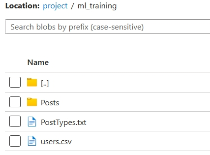
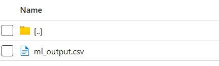

# Big Data with ADF and Databricks for ML

## 1. Project Overview


This is a Big Data Engineering Project on Azure. Data will be ingested from 2 data sources and ingested into the Data Lake in Azure. In the Data Lake, after a couple of data transformation and Machine Learning Model running, we make the Machine Learning result back to the Data Lake. Then we will use Azure Synapse to connect to the Data Lake, and we will generate a report from the Synapse.

## 2. About Data
### 2.1. Data Background

This dataset is from StackOverflow, a famous online IT developer community. The dataset records daily online posts, including post types and users' information.


**[NOTE]: The data sources was provided and prepared for me when I did the project so you have to create and ingest data on these sources for extraction purpose.**

For the sake of demonstration, you need to have the data stored in two sources to simulate the process of data ingestion and have the two sources of extraction.\
You can be inspired by these two sources to make the ingestio:
- [StackOverflow questions filtered 2009 - 2020 — Kaggle](https://www.kaggle.com/datasets/michaelfumery/stackoverflow-questions-filtered-2011-2021)
- [Stack Overflow Data — Kaggle](https://www.kaggle.com/datasets/stackoverflow/stackoverflow)

**Our two sources is as follows:**
1. **RDS:** Ingest data into AWS RDS (*Postgres*) to have the two tables: **`Users`** and **`PostTypes`**.\
These are 2 slow change tables, we need to update them once every week. The update will follow *SCD type 1*, which means we only keep the new records and overwrite the old records.
2. **Azure Storage Blob**: Now for this source, you have to ingest the daily **`Posts`** data.  

## 3. Business Requirements
### 3.1. Data Lake Requirements
- Create a Data Lake. It is nothing but the Azure Storage Blob but with the features of hierarchical namespace.
- Create an Azure Data Factory to finish the data ingestion and processing.
- Connect to an AWS RDS Postgres database and ingest PostTypes and Users tables from RDS to your Data Lake. But you need to ingest once every week.
- Connect to a WeCloudData Azure blob container to copy the parquet files of Posts from StackOverflow into your data lake. You need to ingest it every day.

### 3.2 Machine Learning Process Requirements
You need to create a Databricks notebook to process data and feed the data into a Machine Learning Model, and output the running result from the Machine Learning Model.\
The purpose of this machine learning model is to read the posts' text in the Posts files, and classify what topic of this post is about. And then, we will use Spark to output a file to list all the topics for today and order the topics by their numbers.

But before the output, we need a series work to clean and transform the data.

### 3.3. Chart Requirements
You need to create a chart on Synapse based on the output result data of the Machine Learning Model to display the top 10 topics of today.

## 4. Project Infrastructure
In this project, all the infrastructure is built on Azure.

- **Azure Data Lake**: Create a data lake. The data lake will be used for: Storing the ingested Posts, PostTypes and Users files; Storing the data file for Machine Learning; Storing the output data file after the Machine learning.
- **Azure Data Factory (ADF)**: Finish the entire pipeline from data ingestion, transformation to Machine learning job.
- **Azure Synapse**: Works as a platform to do data analysis.

## 5. Answering Project Business And ML Process Requirements

### 5.1 Data Ingestion
**Please make sure to create a resource group where all of your resources (services) will be located**
#### 5.1.1 Azure Storage Account
1. Created a container in Azure Storage Account which will be our (Data Lake).

The container will have the three folders/directories:
    - **`Posts`**: it will recieve the daily posts from the *Azure Blob Storage* source.
    - **`Users`** and **`PostTypes`** from the other source (*RDS*).

#### 5.1.2 Azure Data Factory
1. Create *Azure Data Factory*, you can refer to the following docs for the setup process:
    - [Quickstart: Create a data factory by using the Azure portal — Microsoft Learn](https://learn.microsoft.com/en-us/azure/data-factory/quickstart-create-data-factory)
    - [Quickstart: Get started with Azure Data Factory — Microsoft Learn](https://learn.microsoft.com/en-us/azure/data-factory/quickstart-get-started)\

***[Please be adviced about this tip before the next step to create and test run your pipelines after the finishing of the Databricks creation to add the Databricks as a linked service and then later after the transformation adding the notebook of model deployment to that linked service to trigger the notebook.]***

2. Create 3 Linked Services, the fourth one is for Databricks, and can be created after creating the Azure Databricks instance.\
Make sure to have all the credintials for these linked services and test the connection in order to move on to the next step.\
Example:


3. Create 6 datasets for the purpose of creating a source and sink for the ADF activities as presented in the below example picture:

Those datasets are made for the two pipelines that we are going to create in the next step:
    - For pipeline 1, you need to create 4 datasets:
        - Two datasets represent the **`postTypes`** and **`Users`** tables on Postgres.
        - Two datasets represent the **`postTypes`** and **`Users`** files copied from Postgres and stored in your blob storage.
    - For pipeline 2, you need to create 2 datasets:
        - A dataset represents the **`Posts`** parquet* files on the ingested storage blob created for the simulation as been made with the RDS (Postgres) one.
        - A dataset represents the **`Posts`** parquet* files on your own storage blob.

    **As for pipeline 1, make sure to choose the datasets as CSV, and pipeline 2 as Parquet*


4. Create 2 pipelines one for weekly copy and another for daily copy, as in the example pictures below:
    - **Daily Pipeline** (You will create the Databrcks linked service later and test your pipeline):
    
    
    - **Weekly Pipeline**:
    

#### 5.1.3 Azure Databricks
Now you have to create the Databricks instance where you would place your notebooks and do the transformations and ML.\
Follow these steps to create Azure Databricks:
1. Open your Azure portal, and go to the resource group of your project, and click ***Create***.
2. Search for ***Databricks*** and hover to the service and click on ***Create***.
3. Enter your workspace name, and choose a pricing tier of your choice (Trial is preferable).
4. click on ***Review + create***, and proceed with the creation and deployment process.

You **MUST** create a Spark Cluster (Compute) in order to work with the Databricks notebooks.
These are the preferable configs for your cluster:
- **Policy**: *Personal Compute*.
- **Instance Type**: *Standard_DS3_v2 (14 GB Memory, 4 Cores)*.
- **Runtime**: *14.0 ML (Scala 2.12, Spark 3.5.0)* (or the most LTS runtime depends on the requirements).

Now, you can either clone this repo in your workspace, or import the Databricks notebooks as you like.

But first, in order to create the connection to your datalake, the one you created in *[Section 5.1.1](#511-azure-storage-account)* you have mount your blob (container) to Databricks in order to load and store data in Databricks.\
For the sake of simplicity and testing, and in our case in creating this project, we got the secret key straight from the Storage Account, but it is advisable to store the key in your Azure Databricks workspace securely.\
In order to achieve that, I advice you to chack [this resource](https://learn.microsoft.com/en-us/azure/key-vault/general/integrate-databricks-blob-storage#create-a-key-vault-and-set-a-secret).

In [our notebook](src/dbc_notebooks/Mount_Storage_container.dbc) for mounting the Storage Account, we specified the key directly, but you can use this code to mount as a better practice and for production instead of testing and development by having your key as a secret:
```python
dbutils.fs.mount(
source = "wasbs://<your-container-name>@<your-storage-account-name>.blob.core.windows.net",
mount_point = "/mnt/<mount-name>",
extra_configs = {"<conf-key>":dbutils.secrets.get(scope = "<scope-name>", key = "<key-name>")})

display(
  dbutils.fs.ls("/mnt/<mount-name>")
)
```
In our case, we named our container `deBDProject` so it depends on your container naming, and don't forget to enable the DBFS from your workspace settings.

### 5.2 Data Transformation
#### 5.2.1 ML Training
In the container you connected with Databricks, create a new folder called `ml_training`, upload the `PostTypes.txt` and `users.csv` from your local sample data into the folder. Then, in the `ml_training` folder, create a new subfolder, call it `Posts`, and upload all the parquet files in the local `Posts` folder into this cloud `Posts` folder.


In the [ml training notebook](src/dbc_notebooks/ML_Training.dbc), we will use machine learning and Sentiment analysis method to train a machine learning model. The model will use to our everyday Posts files to tell us what each post is about (the topic of the post).

What we are going to do:
- **Step 1:** Loading the data into dataframes:
    1. Creating the `Posts` dataframe.
    2. Creating the `posttypes` dataframe.
    3. Creating the `users` dataframe.
    4. Saving the dataframes for easy retrieval.
- **Step 2:** Join tables and filter data:
    1. Prepare necessary libraries and load data.
    2. Join the tables `Posts` and `postTypes` by it post type id.
    3. Filter the data.
    4. Create a checkpoint to save the dataframe to file only contain the Body and Tag we need.
- **Step 3:** Based on the above dataframe, prepare data from machine learning (Text Cleaning Preprocessing).
- **Step 4:** Machine Learning Model Training:
    1. Feature Transformer
        - Tokenizer.
        - Stopword Removal.
        - CountVectorizer (TF - Term Frequency).
        - TF-IDF Vectorization.
    2. Label Encoding.
    3. Model Training.
    4. Model Eval.
    5. Create a Pipeline.
- **Step 5:** Save the Model file to Azure storage

Example of the final look of your storage account (blob/datalake):

Files can be reorganized in the way you like, as having all the folders (except `ml_training`, `model`, and `BI`) inside a `landing` folder unlike my version in this example:


#### 5.2.2 NLP
##### NLP Requirement:
Generate a CSV file with 2 columns: topic and qty. This file will be used for the BI reports generation in the next week. This file will be generated by our trained ML model and a couple of further steps.

- The model will review the posts column in our `Posts` file (in the file the column is called “Body”) and give a topic to each of the posts.
- Then we will use a Python function to calculate the quantity of each topic to generate a summary file to list the quantity of each topic.

In [this notebook](src/dbc_notebooks/Model_Deployment.dbc) we will utilize the trained model to generate predictions on unseen data, then calculate the topics predicted by the model to summarize the quantity of each topic, and finally save the summary table to the Azure storage folder which will be used for BI.

This is the guide through the notebook:
1. Load the ML model and the stringIdexer generated in the previous part of transformation ([ML Training](#521-ml-training)), and also the `Posts` file
2. Create a UDF (User Defined Function) function to filter and transform the data and generate model result.
3. Run the UDF and generate the result.
4. Summarize which topics are the most popular.
6. Save the result file to the BI folder.

##### Back to Azure Data Factory:
Now, let's go to the Data factory to add this notebook to our everyday-run pipeline that you created before. We need to run this notebook every day to process every day's new Posts file, so we put it in our everyday-run pipeline.

Remember the process of adding link services?
Well if you haven't created the Databricks linked service, you can follow along with this [documentation](https://learn.microsoft.com/en-us/azure/data-factory/transform-data-using-databricks-notebook).

Now test run your pipelines, and it sould be something like the [example picture](#512-azure-data-factory) for when we created the pipelines and told about creating the Databricks linked service later.

You also have to [schedule your pipeline](https://learn.microsoft.com/en-us/azure/data-factory/how-to-create-schedule-trigger?tabs=data-factory) to make it run at your preferable time.\
You should get this when the pipline schedule gets triggered:

### 5.3 Data Load
Before starting to use Azure Synapse Analytics, make sure you have stored the machine learning result file in your storage blob container.


#### Creating Azure Synapse Analytics Workspace
Creating an Azure Synapse Analytics Workspace is an easy process just like what have been created along the project.\
You will only have to make sure to link your own Storage Account to your workspace in order to get `ml_output.csv`.

Now, you can go to your linked Storage Account and hit `Preview`.

You will see a a T-SQL query script, and you have to apply the below to get the reults right instead of running that query:
- Either replace the `100` on your `SELECT` and add `HEADER_ROW = TRUE` at the end of the `OPENROWSET` method, and the code looks like this, but don't forget to replace `'PATH_TO_YOUR_OUTPUT_CSV'` with yours in the default query:
```sql
SELECT
    TOP 5 *
FROM
    OPENROWSET(
        BULK 'PATH_TO_YOUR_OUTPUT_CSV',
        FORMAT = 'CSV',
        PARSER_VERSION = '2.0',
        HEADER_ROW = TRUE
    ) AS [result]
```

There you will have the visulization we need as a final chart and result, and the transformation process can be reporpused anyway to meet your requirements.

## Results
Azure Synapse Analytics came with this chart, and with it the results shown in the x-axis as the top 5 `topics`, and the quantity (`qty`) of posts.


## Conclusion
As I wrapped the project up, we learn a lot about the Azure tools for data engineering, especially Databricks, that's why after a taking a deep-dive and in depth about this cloud data platform, it came to my attention that Databricks holds a great potential that makes the data engineer relies on nothing but its built in capabilities, because with it you can create your own pipeline without relying on Azure Data Factory, but I know that using Azure Data Factory was for the sake of demoontrating multiple uses for a data engineers, and as for the visualization, there's also a built-in visualization capability on Databricks as well, which makes it a powerful cloud data platform, and I didn't talk about other potentials features that would make it a key choice for any enterprise for data.

<br><br><br>

I want to thank my friend and colleague [Khalid Sharahili](https://www.linkedin.com/in/kld-sharahili/) for being a big part of the project and helping me work in it, and understanding it well. 

<br><br><br>

**THANK YOU SO MUCH!!!! for going through my documntation of the second data engineering capstone project.**